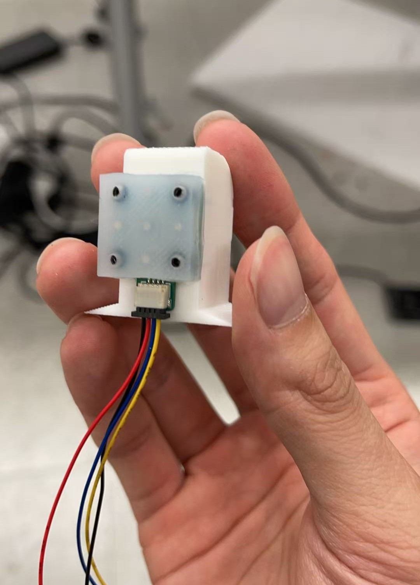

# Tactile Sensor Repository

## Overview
This repository contains the code, firmware, datasets, and documentation for a custom magnetic tactile sensor designed for robotic dexterous manipulation. It provides tools for sensor calibration and synchronized data collection, model training and evaluation, real-time inference, and visualization utilities to map raw magnetic readings to contact force estimates.

<p align="center">
	
</p>

*The magnetic tactile sensor.*

### Project Goal
Provide a complete, reliable pipeline that converts raw magnetic field measurements into accurate 3D force predictions for real-time tactile feedback in robotic hands, enabling force-aware manipulation and improved interaction performance.

### Repository Structure
- `calibration.py` is the calibration script. 
- `train.py` is for training the MLP. data.zip is the train data collected by Minghui. 
- `model/model.pth` is trained with this data and saved in `/model`. 
- `model/scaler.pkl` is the saved feature normalizer from training. 
- `tactile_force_predict.py` is the output script using the model to give 3D force predictions.
- `Arduino/sensor/sensor.ino` is the arduino communication script to read raw data from the magnetometers.
- `Arduino/sensor_mux/sensor_mux.ino` is the arduino communication script to read multiple tactile sensors simultaneously with a multiplxer.
- `visual_2d` is visualization script to see the magnitude and direction of predicted 3D forces.
- `circuits/` includes the circuit designs and materials for PCB.
- `parts/` includes the mold designs for the silicone layer.

## Pipeline
Calibrate the tactile sensor with a xArm7 robot arm, collect tactile and ft sensor data in calibration, then train a MLP to predict 3D force values with tactile data as input.

### 0. Installation
1. Clone this repository:
```bash
git clone https://github.com/JustinJiang11/Magnetic_Tactile_Sensor.git
```

2. Install the package (editable mode):
```bash
pip install -e .
```

### 1. Data Collection
Run `calibration.py` to collect synchronized tactile and force-torque (FT) data.

Collection procedure:
- In `calib()`, the robot first moves to a specified start point.
- It then calls `move_down()` to reach the target contact depth.
- Next, it executes `move_linear_quasi_static()` in one selected direction and records data during the motion.
- Finally, the collected samples are saved to disk.

Sampling coverage:
- 8 motion directions: right, bottom, left, top, top_right, top_left, bottom_right, bottom_left.
- Directional motion distance: 2 mm.
- 9 start points: (0, 0), (0, 5), (5, 0), (0, -5), (-5, 0), (-5, 5), (5, -5), (5, 5), (-5, -5).
- 4 contact depths: 0.2 mm, 0.6 mm, 1.0 mm, 1.4 mm.

### 2. Model Training
The training script is `train.py`. It trains a 3-output MLP to predict force components `[Fx, Fy, Fz]` from tactile readings.

Training data preparation:
- The script recursively loads all `.json` files under `tactile_sensor/data`.
- For each sample, the tactile matrix is flattened into a 15-dimensional input vector.
- The force target is built from `ft_data` as a 3D vector `[ft_data[0], ft_data[1], ft_data[2]]`.

Feature normalization:
- Before model fitting, `StandardScaler` is fit on training features.
- The same transform is applied to validation features.
- A final scaler is fit on the full dataset after cross-validation.
- This final scaler is saved as `scaler.pkl` and must be used at inference time.

Model architecture:
- Input: 15 features.
- Hidden layers: 200 -> 200 -> 40 -> 200 -> 200 with ReLU activations.
- Output layer: 3 units for `[Fx, Fy, Fz]`.

Optimization setup:
- Loss: Mean Squared Error (MSE).
- Optimizer: Adam.
- Batch size: 32.
- Learning rate: `1e-3`.
- Epochs: 100.

Cross-validation training:
- The script uses 5-fold K-Fold cross-validation (`shuffle=True`, `random_state=42`).
- For each fold:
	- Train on 4 folds and validate on 1 fold.
	- Record train and validation losses for each epoch.
	- Save fold loss curves to `model/3d/loss_plots/fold_<k>_curve.png`.

Final model training:
- After CV summary, the model is retrained on the full dataset.
- Final artifacts are saved to:
	- `model/3d/model.pth`
	- `model/3d/scaler.pkl`

### 3. Model Evaluation
Evaluation is performed during each CV fold and then summarized across all 5 folds.

Per-axis regression metrics:
- MAE for `Fx`, `Fy`, and `Fz`.
- RMSE for `Fx`, `Fy`, and `Fz`.

Vector-force metric:
- The script also computes vector error `||F_pred - F_gt||` and reports:
	- Vector MAE.
	- Vector RMSE.

Tolerance-based accuracy metrics:
- A prediction is counted as correct for one axis if `|error| <= tolerance`.
- Default tolerance in `train.py` is `0.5 N`.
- Reported accuracy values:
	- `Fx ACC`, `Fy ACC`, `Fz ACC`.
	- `All-axis element ACC`: fraction of all axis elements (all samples, all 3 axes) within tolerance.
	- `Sample all-3 ACC`: fraction of samples where all three axis errors are within tolerance at the same time.

Fold-by-fold and summary output:
- Each fold prints a detailed metric block.
- At the end, the script reports mean +- std across folds for all regression and accuracy metrics.

How to interpret quickly:
- Lower MAE/RMSE means better force magnitude prediction.
- Higher ACC means more predictions fall inside your practical force error band.

### 4. Real-Time Prediction
Run `tactile_force_predict.py` to get the live force predictions when using the tactile sensor.

The `model.pth` is loaded here and convert the raw tactile readings to predictions.

### 5. Hardware and Serial Settings
For calibration, connect the USB wires from Arduino and FT sensor to your PC.

### 6. Collected Data Link
Here is the Google Drive link for the dataset used to train the model with `train.py`:
https://drive.google.com/file/d/1tLeQpZmvOzUjpguUfn9IWXpNeGf5ICPe/view?usp=sharing
